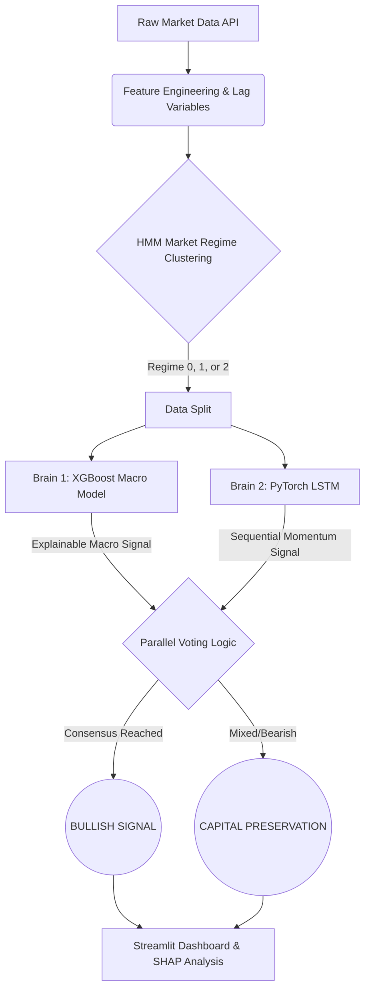

# 🚀 Macro-Alpha Engine: Dual-Brain Market Forecasting


An automated, cloud-native machine learning pipeline that forecasts S&P 500 directional movement. Instead of relying on a single monolithic model, this system utilizes a **Dual-Brain Parallel Voting Ensemble** combined with **Unsupervised Market Regimes** to generate highly explainable, risk-adjusted trading signals.

🌐 **[Live Application (Insert Your AWS Link Here)](#)**

---

## 🧠 System Architecture

The pipeline processes daily macroeconomic and technical data, clustering the current market environment before passing the data to two independent predictive "brains."



## 🗝️ Core Methodology

### 1. Unsupervised Context (Hidden Markov Model)

Financial markets are non-stationary. To prevent the models from applying "bull market rules" during a crash, the pipeline uses a Gaussian Hidden Markov Model (`hmmlearn`) to mathematically cluster the S&P 500 into three distinct volatility regimes (Quiet Bull, Choppy/Transition, Extreme Bear). The predictive models dynamically adjust to these latent states.

### 2. The Risk Manager (XGBoost)

A tree-based gradient boosting model that evaluates slow-moving, structural macroeconomic features:

* The Yield Curve (10Y-2Y Spread)
* Monetary Policy (Effective Federal Funds Rate)
* Market Fear (VIX)
* **Explainable AI (XAI):** Integrated with `SHAP` (SHapley Additive exPlanations) to provide real-time, feature-level transparency for every prediction.

### 3. The Momentum Trader (PyTorch LSTM)

A deep learning Long Short-Term Memory neural network that entirely ignores the macro economy. It analyzes the sequence of the last 10 trading days (Returns, Volatility, RSI) to capture complex, short-term temporal price patterns.

### 4. Parallel Ensemble Voting

To issue a `BUY` signal, both models must independently output a probability exceeding the user-defined Conviction Threshold. If structural fundamentals do not align with short-term price momentum, the system defaults to capital preservation (Cash).

---

## 🚀 Local Installation & Setup

Want to run the Macro-Alpha Engine on your local machine?

**1. Clone the repository:**

```bash
git clone [https://github.com/yourusername/macro_alpha.git](https://github.com/yourusername/macro_alpha.git)
cd macro_alpha

```

**2. Create a virtual environment:**

```bash
python -m venv venv
source venv/bin/activate  # On Windows use: venv\Scripts\activate

```

**3. Install dependencies:**

```bash
pip install -r requirements.txt

```

**4. Run the Data Pipeline & Feature Engineering:**

```bash
python src/feature_engineering.py

```

**5. Launch the Dashboard:**

```bash
streamlit run dashboard/app.py

```

---

## 🧪 Historical Diagnostics

*Metrics based on Out-of-Sample / In-Sample Walk-Forward validation.*

* **Strict ML Evaluation:** Avoids traditional "Sharpe Ratio" overfitting by evaluating pure classification metrics (Precision, F1-Score, Confusion Matrix).
* **Accountability:** The dashboard tracks the rolling 14-day history, logging the model's confidence, signal, and the actual 5-day Profit/Loss outcome.

## 🛠️ CI/CD & Deployment

This project is containerized using **Docker** (with strict lightweight CPU tensor dependencies for cost-effective hosting) and deployed on an **AWS EC2** instance. The data pipeline is automated to harvest new market data and refresh features daily without manual intervention.

```

Would you like to move straight into adding the error bounds or the shaded regime bands from Phase B next?

```
