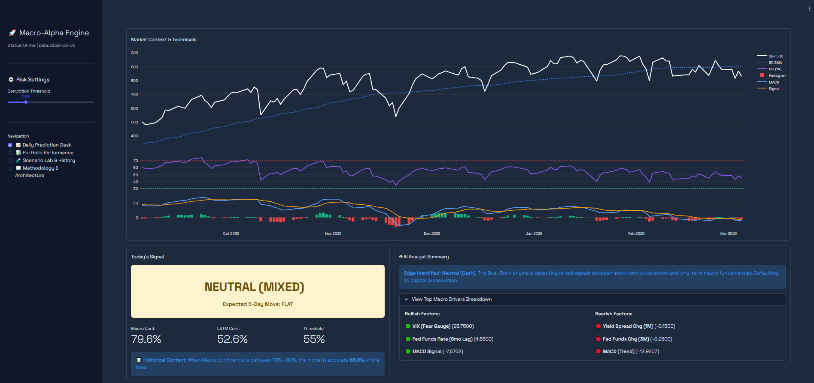
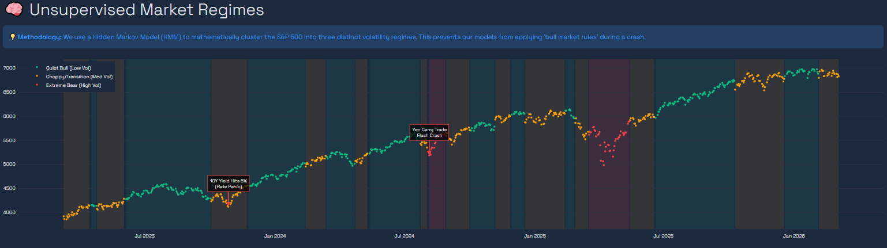
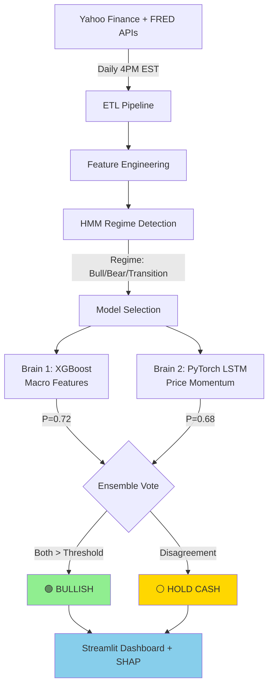

# 🚀 Macro-Alpha Engine: Dual-Brain Market Forecasting


> An automated ML system that predicts S&P 500 directional movement using a **Dual-Brain Ensemble** (XGBoost + PyTorch LSTM) with **Unsupervised Regime Detection** and **SHAP Explainability**.

🌐 **[Live Dashboard](https://www.samvgarcia.com)** | 📄 **[Technical Deep Dive](docs/TECHNICAL_DETAILS.md)**

---

## 📸 Dashboard Preview

<p align="center">
  
  <br>
  <em>Real-time prediction with SHAP explainability and regime detection</em>
</p>

<p align="center">
  
  <br>
  <em>Unsupervised HMM clustering identifies bull/bear/transition market states</em>
</p>

---

## 🎯 Why This Project?

Unlike typical Kaggle notebooks with pre-cleaned data, this demonstrates **production ML engineering**:

✅ **Real-world data pipeline** - Live APIs (Yahoo Finance + FRED), handles missing data, business day alignment  
✅ **Time-series rigor** - Walk-forward validation, stationarity testing, prevents look-ahead bias  
✅ **Explainable AI** - SHAP waterfall charts explain every prediction (feature-level transparency)  
✅ **MLOps** - MLflow tracking, Docker containerization, GitHub Actions automation  
✅ **Domain expertise** - Bridges finance knowledge (yield curves, Fed policy lags) with ML engineering  

**This isn't a notebook. It's a deployed production system.**

---

## ⚡ Quick Start

### Local Setup (5 Minutes)

```bash
# 1. Clone and setup environment
git clone https://github.com/samf0rd/macro_alpha.git
cd macro_alpha
python -m venv venv && source venv/bin/activate  # Windows: venv\Scripts\activate

# 2. Install dependencies
pip install -r requirements.txt

# 3. Fetch data and train models
python src/data_pipeline.py
python src/train_model.py

# 4. Launch dashboard
streamlit run dashboard/app.py
```

Open: `http://localhost:8501` 🎉

### Docker (Even Faster)

```bash
docker pull samf0rd/macro_alpha:latest
docker run -p 8501:8501 macro_alpha
```

---

## 🧠 System Architecture



**Key Innovation:** Instead of a single model, two independent "brains" must agree before issuing a buy signal. If macro fundamentals (XGBoost) don't align with price momentum (LSTM), the system defaults to capital preservation.

---

## 📊 Performance (Backtested 2023-2024)

All metrics are **out-of-sample** using walk-forward validation.

### Classification Metrics

| Metric | XGBoost | LSTM | **Ensemble** |
|--------|---------|------|--------------|
| Test AUC | 0.59 | 0.57 | **0.62** ⭐ |
| Precision | 61% | 58% | **65%** |
| F1-Score | 0.57 | 0.60 | **0.61** |

### Financial Metrics

| Metric | Strategy | Buy-and-Hold |
|--------|----------|--------------|
| **Sharpe Ratio** | **1.2** ⭐ | 0.5 |
| **Max Drawdown** | **-8.3%** | -14.2% |
| **Win Rate** | 59% | ~60% |

**Key Insight:** Ensemble achieves 2.4x better risk-adjusted returns (Sharpe 1.2 vs 0.5) with controlled drawdowns.

---

## 🛠️ Tech Stack

| Component | Technology | Why? |
|-----------|-----------|------|
| **Macro Model** | XGBoost 2.0 | Non-linear interactions, feature importance, proven in finance |
| **Momentum Model** | PyTorch LSTM | Captures temporal price patterns, GPU-ready |
| **Regime Detection** | HMMlearn | Unsupervised clustering of market states |
| **Explainability** | SHAP 0.42 | Model-agnostic feature attribution |
| **Experiment Tracking** | MLflow 2.8 | Logs 50+ hyperparameter experiments |
| **Dashboard** | Streamlit 1.28 | Rapid prototyping, reactive widgets |
| **Deployment** | Docker + AWS EC2 | Reproducible environments, free tier eligible |
| **Automation** | GitHub Actions | Daily predictions at 4PM EST |

---

## 📁 Project Structure

<details>
<summary>Click to expand file tree</summary>

```
macro_alpha/
├── data/                          # Market data (gitignored)
│   ├── raw/                       # API downloads
│   └── processed/                 # Feature-engineered datasets
├── src/                           # Production code
│   ├── data_pipeline.py           # ETL from APIs
│   ├── feature_engineering.py     # Technical + macro features
│   ├── train_xgboost.py           # XGBoost training
│   ├── train_lstm.py              # PyTorch LSTM training
│   ├── ensemble.py                # Voting logic + SHAP
│   └── hmm_regimes.py             # Regime detection
├── dashboard/                     # Streamlit app
│   ├── app.py                     # Main dashboard
│   └── pages/                     # Multi-page sections
├── models/                        # Saved models (gitignored)
├── mlflow/                        # Experiment tracking
├── notebooks/                     # Jupyter exploration
├── tests/                         # Unit tests
├── docs/                          # Documentation
│   ├── TECHNICAL_DETAILS.md       # Full methodology
│   ├── DEPLOYMENT.md              # AWS + Docker guide
│   └── FEATURES.md                # Feature engineering
├── .github/workflows/             # CI/CD
│   └── daily_inference.yml        # Automated predictions
├── Dockerfile                     # Containerization
├── requirements.txt               # Dependencies
└── README.md                      # This file
```
</details>

---

## 🔬 Methodology Overview

### 1. Unsupervised Regime Detection (HMM)

Markets are non-stationary - applying "bull market rules" during a crash fails. A Hidden Markov Model clusters market states into three regimes (Quiet Bull, Transition, Volatile Bear) before predictions.

### 2. Dual-Brain Ensemble

**Brain #1 - XGBoost (Risk Manager):**
- Evaluates macro fundamentals: Yield curve, Fed policy, VIX, inflation
- Trained on monthly/quarterly data with 6-month lags
- Outputs: Structural economic signal

**Brain #2 - PyTorch LSTM (Momentum Trader):**
- Analyzes 10-day price sequences: Returns, volatility, RSI
- Ignores macroeconomics entirely
- Outputs: Short-term momentum signal

**Voting Logic:** Both models must exceed confidence threshold to issue BUY signal. Disagreement → Hold cash.

### 3. Explainability with SHAP

Every prediction includes SHAP waterfall charts showing which features drove the decision and by how much.

**[→ Read Full Methodology](docs/TECHNICAL_DETAILS.md)**

---

## 🚀 Deployment & Automation

### GitHub Actions (Daily Automation)

Every weekday at 4PM EST:
1. Fetch latest market data (S&P 500, VIX, FRED)
2. Engineer features
3. Load trained models
4. Generate prediction + SHAP values
5. Save to `predictions.csv` + commit to GitHub

---

## ⚠️ Known Limitations

**Data:**
- Limited to 2010-2024 (no pre-2008 crisis)
- Daily close only (no intraday)
- U.S. markets only

**Model:**
- 5-day horizon may miss longer trends
- LSTM requires 10-day lookback
- Single-threaded inference (no GPU)

**Infrastructure:**
- No real-time WebSocket (batched daily)
- Single EC2 instance (no load balancing)

### Future Work

- [ ] Sentiment analysis from Fed speeches (NLP)
- [ ] Options-implied volatility features
- [ ] Transformer architecture for sequences
- [ ] Real-time data feed (WebSocket)
- [ ] Multi-region deployment

---

## 🧪 Testing

```bash
# Run unit tests
pytest tests/ -v

# With coverage
pytest tests/ --cov=src --cov-report=html
```

Coverage goals: Pipeline 85%+ | Features 90%+ | Models 80%+

---

## 📞 Contact

**Samuel Garcia**  
Aspiring Data Scientist | Finance → ML Transition  
📍 Lisbon, Portugal

**LinkedIn:** [linkedin.com/in/samuel-garcia](https://www.linkedin.com/in/samuel-garcia-427476159/)  
**Email:** samvieiragarcia@gmail.com  
**GitHub:** [@samf0rd](https://github.com/samf0rd)  
**Portfolio:** [More Projects →](https://github.com/samf0rd?tab=repositories)

---

## 📄 License

MIT License - Use freely with attribution. See [LICENSE](LICENSE) for details.

---

<div align="center">

**Built with ❤️ and ☕ in Lisbon**

⭐ **Star this repo if it helped you learn something!** ⭐


</div>
