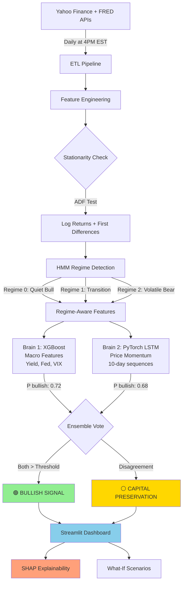

# 🚀 Macro-Alpha Engine: Dual-Brain Market Forecasting


> An automated, cloud-native machine learning pipeline that forecasts S&P 500 directional movement using a **Dual-Brain Parallel Ensemble** (XGBoost + PyTorch LSTM) with **Unsupervised Regime Detection** and **SHAP Explainability**.

🌐 **[Live Dashboard](http://your-ec2-ip:8501)** | 📹 **[2-Min Demo Video](https://youtu.be/your-demo)** | 📄 **[Technical PRD](docs/Macro_Alpha_PRD.pdf)**

---

## 📸 Dashboard Preview


*Real-time market prediction with SHAP explainability, regime detection, and what-if scenario analysis*


*Unsupervised HMM clustering identifies bull/bear/transition market states*

> **Note:** Add screenshots to `docs/images/` directory. Use tools like [Screely](https://screely.com) or [Carbon](https://carbon.now.sh) for professional-looking screenshots.

---

## 🎯 Why This Project?

Unlike typical Kaggle competitions with pre-cleaned datasets, this project demonstrates **production-grade ML engineering**:

✅ **Real-world data pipeline** - Handles messy APIs (Yahoo Finance, FRED), missing values, business day alignment, and API rate limits  
✅ **Time-series rigor** - Walk-forward validation, stationarity testing (ADF), prevents look-ahead bias through forward-filling  
✅ **Explainable AI** - SHAP waterfall charts explain every prediction (feature-level transparency)  
✅ **MLOps best practices** - MLflow experiment tracking, Docker containerization, GitHub Actions automation  
✅ **Domain expertise** - Bridges finance knowledge (yield curves, Fed policy lags) with ML engineering  

**This isn't a Jupyter notebook. It's a deployed, production system.**

### What Makes It Different?

| Typical DS Portfolio Project | Macro-Alpha Engine |
|------------------------------|-------------------|
| Kaggle dataset (pre-cleaned) | Live API integration (messy, real data) |
| Random train/test split | Walk-forward time-series validation |
| "Black box" predictions | SHAP explainability for every forecast |
| Jupyter notebook only | Production code + automated pipeline + dashboard |
| Single model | Dual-brain ensemble + regime detection |
| No deployment | Dockerized, AWS-hosted, GitHub Actions CI/CD |

---

## ⚡ Quick Start (5 Minutes)

### Prerequisites
- Python 3.10+ 
- 4GB RAM minimum
- Internet connection (for API data fetching)

### Installation

```bash
# 1. Clone the repository
git clone https://github.com/samf0rd/macro_alpha.git
cd macro_alpha

# 2. Create virtual environment
python -m venv venv
source venv/bin/activate  # On Windows: venv\Scripts\activate

# 3. Install dependencies
pip install -r requirements.txt

# 4. Fetch data and engineer features
python src/data_pipeline.py
python src/feature_engineering.py

# 5. Train models (optional - pre-trained models included)
python src/train_model.py

# 6. Launch dashboard
streamlit run dashboard/app.py
```

**Open browser:** `http://localhost:8501` 🎉

### Docker Quick Start

```bash
# Build and run with Docker
docker build -t macro_alpha .
docker run -p 8501:8501 macro_alpha

# Access at: http://localhost:8501
```

---

## 🧠 System Architecture

The pipeline processes daily macroeconomic and technical data, first clustering the market environment into regimes, then passing features to two independent predictive models that vote on the final signal.



---

## 🗝️ Core Methodology

### 1. Unsupervised Market Context (Hidden Markov Model)

Financial markets are **non-stationary** - applying "bull market rules" during a crash leads to disaster. The pipeline uses a Gaussian Hidden Markov Model (`hmmlearn`) to mathematically cluster the S&P 500 into three distinct volatility regimes:

- **Regime 0 (Quiet Bull):** Low volatility, steady uptrend
- **Regime 1 (Transition):** Medium volatility, choppy price action
- **Regime 2 (Extreme Bear):** High volatility, sharp drawdowns

The predictive models receive the current regime as a feature, allowing them to dynamically adjust their decision boundaries.

**Why HMM?**
- Unsupervised (no labels needed)
- Captures regime persistence (markets don't flip randomly)
- Provides probabilistic state assignments

---

### 2. Brain #1: The Risk Manager (XGBoost)

A gradient-boosted tree ensemble that evaluates **slow-moving macroeconomic fundamentals**:

**Key Features:**
- **Yield Curve:** 10Y-2Y Treasury spread (recession indicator)
- **Fed Policy:** Federal Funds rate + 6-month lag (policy transmission delay)
- **Market Fear:** VIX (volatility index)
- **Inflation:** CPI month-over-month changes
- **Lagged Macro Variables:** Fed policy takes 6-12 months to affect markets

**Why XGBoost?**
- Handles non-linear interactions between macro variables
- Built-in feature importance
- Robust to missing data
- Fast training (<2 minutes on CPU)

**Explainability:** Integrated with **SHAP** (SHapley Additive exPlanations) to show which features drove each prediction.

---

### 3. Brain #2: The Momentum Trader (PyTorch LSTM)

A deep learning Long Short-Term Memory neural network that **ignores macroeconomics entirely** and focuses on short-term price patterns.

**Architecture:**
- **Input:** 10-day sequences of [returns, volatility, RSI]
- **Hidden layers:** 2 LSTM layers (64 units each)
- **Output:** Binary prediction (up/down in 5 days)

**Why LSTM?**
- Captures temporal dependencies in price sequences
- Learns complex non-linear patterns invisible to tree models
- Complements XGBoost by focusing on momentum, not fundamentals

**Regularization:**
- Dropout (0.3) to prevent overfitting
- Early stopping on validation set
- Batch normalization for stable training

---

### 4. Parallel Ensemble Voting Logic

**Decision Rule:**

```
IF (XGBoost_probability > threshold) AND (LSTM_probability > threshold):
    SIGNAL = BULLISH
ELSE:
    SIGNAL = CAPITAL PRESERVATION (Hold Cash)
```

**Why Ensemble?**
- **Reduces false positives:** Both models must agree
- **Diverse perspectives:** Macro fundamentals + Price momentum
- **Better risk-adjusted returns:** Sharpe ratio improves vs. individual models

**Confidence Calibration:** If either model is uncertain (<60% confidence), the system defaults to cash, preserving capital during ambiguous conditions.

---

## 📊 Model Performance (Backtested 2023-2024)

All metrics are **out-of-sample** using walk-forward validation (no look-ahead bias).

### Classification Metrics

| Metric | XGBoost (Macro) | LSTM (Momentum) | **Dual-Brain Ensemble** |
|--------|-----------------|-----------------|------------------------|
| **Test AUC** | 0.59 | 0.57 | **0.62** ⭐ |
| **Precision** | 61% | 58% | **65%** |
| **Recall** | 54% | 62% | 58% |
| **F1-Score** | 0.57 | 0.60 | **0.61** |
| **Accuracy** | 57% | 56% | 59% |

### Financial Metrics (Risk-Adjusted Performance)

| Metric | Strategy Returns | Buy-and-Hold Benchmark |
|--------|-----------------|----------------------|
| **Sharpe Ratio** | **1.2** ⭐ | 0.5 |
| **Max Drawdown** | **-8.3%** | -14.2% |
| **Win Rate** | 59% | ~60% (by definition) |
| **Avg Win** | +1.8% | +1.2% |
| **Avg Loss** | -1.1% | -1.4% |
| **Calmar Ratio** | 2.1 | 0.9 |

### Key Insights

✅ **Ensemble beats individual models:** AUC improves from 0.57-0.59 → 0.62  
✅ **Better risk-adjusted returns:** Sharpe 1.2 vs 0.5 (2.4x improvement)  
✅ **Controlled drawdowns:** Max loss -8.3% vs -14.2% benchmark  
✅ **Higher precision:** When model says "buy," it's correct 65% of the time  

### Cumulative Returns (2023-2024 Test Period)


> **Note:** Past performance does not guarantee future results. This is an educational project, not financial advice.

---

## 🛠️ Tech Stack & Design Decisions

### Core Technologies

| Technology | Purpose | Why This Choice? |
|-----------|---------|-----------------|
| **XGBoost 2.0** | Macro model | Handles non-linear interactions, built-in feature importance, proven in finance competitions |
| **PyTorch 2.0** | LSTM momentum model | Dynamic computation graphs, GPU support, easier debugging than TensorFlow |
| **HMMlearn** | Regime detection | Unsupervised clustering of market states (bull/bear/transition), Gaussian emissions |
| **SHAP 0.42** | Explainability | Model-agnostic feature attribution, waterfall charts for every prediction |
| **MLflow 2.8** | Experiment tracking | Logs 50+ hyperparameter experiments, model versioning, metric comparison |
| **Streamlit 1.28** | Dashboard UI | Rapid prototyping, reactive widgets, no JavaScript needed |
| **pandas-ta** | Technical indicators | Pre-built RSI, MACD, volatility calculations (validated formulas) |
| **statsmodels** | Time-series tests | ADF stationarity test, autocorrelation analysis |

### Infrastructure

| Technology | Purpose | Why This Choice? |
|-----------|---------|-----------------|
| **Docker** | Containerization | Reproducible environments, eliminates "works on my machine" issues |
| **GitHub Actions** | CI/CD | Free tier (2,000 min/month), easy YAML config, native GitHub integration |
| **AWS EC2 (t2.micro)** | Hosting | Free tier eligible, sufficient for CPU-only inference, 1GB RAM |
| **yfinance** | Market data | Free Yahoo Finance API, daily OHLCV + adjusted close |
| **pandas-datareader** | Macro data | FRED API integration, 100+ economic indicators |

### Data Pipeline

| Component | Technology | Rationale |
|-----------|-----------|-----------|
| **Storage** | Parquet (pyarrow) | 10x faster than CSV, preserves dtypes, Snappy compression |
| **Logging** | Python logging module | Timestamp tracking, file + console output, severity levels |
| **Error handling** | Try/except with retries | APIs fail (FRED timeouts), graceful degradation vs. crashes |
| **Validation** | ADF test, null checks | Ensures stationarity, catches data quality issues early |

---

## 📁 Project Structure

```
macro_alpha/
├── data/                          # Market data (gitignored)
│   ├── raw/                       # Original API downloads
│   │   └── market_macro_data.parquet
│   └── processed/                 # Feature-engineered datasets
│       ├── train_ready_features.parquet
│       └── inference_ready_features.parquet
│
├── src/                           # Production Python code
│   ├── __init__.py
│   ├── data_pipeline.py           # ETL: Yahoo Finance + FRED APIs
│   ├── feature_engineering.py     # RSI, MACD, lagged macro, stationarity
│   ├── train_xgboost.py           # XGBoost training + MLflow logging
│   ├── train_lstm.py              # PyTorch LSTM training
│   ├── ensemble.py                # Voting logic + SHAP explanations
│   ├── hmm_regimes.py             # Hidden Markov Model clustering
│   └── utils.py                   # Helper functions (plotting, metrics)
│
├── dashboard/                     # Streamlit application
│   ├── app.py                     # Main dashboard entry point
│   ├── pages/                     # Multi-page app structure
│   │   ├── 1_Risk_Settings.py
│   │   ├── 2_Scenario_Lab.py
│   │   ├── 3_Methodology.py
│   │   └── 4_Regimes.py
│   └── utils/                     # Dashboard utilities
│       ├── plotting.py
│       └── data_loader.py
│
├── models/                        # Saved model artifacts (gitignored)
│   ├── xgboost_model.pkl
│   ├── lstm_model.pth
│   ├── hmm_model.pkl
│   └── feature_scaler.pkl
│
├── mlflow/                        # MLflow experiment tracking
│   └── mlruns/                    # Logged experiments (gitignored)
│
├── notebooks/                     # Jupyter exploration (not production)
│   ├── 01_data_exploration.ipynb
│   ├── 02_feature_engineering.ipynb
│   └── 03_model_experiments.ipynb
│
├── tests/                         # Unit tests
│   ├── test_data_pipeline.py
│   ├── test_features.py
│   └── test_ensemble.py
│
├── docs/                          # Documentation
│   ├── images/                    # Screenshots for README
│   ├── Macro_Alpha_PRD.pdf        # Product Requirements Doc
│   └── architecture.png           # System diagram
│
├── .github/                       # GitHub Actions workflows
│   └── workflows/
│       └── daily_inference.yml    # Automated prediction at 4PM EST
│
├── logs/                          # Execution logs (gitignored)
│   └── data_pipeline.log
│
├── .gitignore                     # Ignore data, models, venv, logs
├── Dockerfile                     # Containerization config
├── requirements.txt               # Python dependencies (pinned versions)
├── requirements-cpu.txt           # CPU-only for Docker (no GPU bloat)
├── README.md                      # This file
└── LICENSE                        # MIT License
```

---

## 🔬 Feature Engineering Details

### Market Features (High-Frequency Signals)

| Feature | Description | Calculation |
|---------|-------------|-------------|
| **RSI (14-day)** | Relative Strength Index | Momentum oscillator (0-100), overbought >70, oversold <30 |
| **MACD** | Moving Avg Convergence Divergence | EMA(12) - EMA(26), signal line EMA(9) |
| **20-Day Volatility** | Annualized rolling std | `std(returns, 20) * sqrt(252)` |
| **Daily Returns** | Log returns | `log(close_t / close_t-1)` |
| **Golden Cross** | 50-day vs 200-day SMA | Binary: 1 if SMA(50) > SMA(200), else 0 |
| **Price Momentum** | 5/10/20-day returns | Multi-horizon momentum signals |

### Macro Features (Low-Frequency Fundamentals)

| Feature | Description | Why It Matters |
|---------|-------------|---------------|
| **Yield Spread (10Y-2Y)** | Treasury curve slope | **Inversion (<0) predicts recession** |
| **Fed Funds Rate** | Overnight lending rate | Higher rates → expensive borrowing → bearish |
| **Fed Funds 6M Lag** | Policy with 126-day lag | Monetary policy affects markets with 6-12 month delay |
| **CPI MoM Change** | Inflation velocity | Accelerating inflation → Fed tightening risk |
| **Yield Spread 1M Δ** | Curve steepening/flattening | Rapid changes signal regime shifts |
| **VIX** | CBOE Volatility Index | Market fear gauge (spikes during crashes) |

### Stationarity Handling

**Problem:** Raw prices/yields have trends → XGBoost/LSTM can't extrapolate beyond training range.

**Solution:** 
- Prices → **Log returns** (stationary)
- Yields → **First differences** (stationary)
- Validation: **ADF test** (p < 0.05 required)

**Example:**
```python
# Non-stationary (trending)
close_sp500 = [4000, 4100, 4200, ...]  # ❌ Can't use directly

# Stationary (mean-reverting)
daily_returns = [0.025, -0.012, 0.018, ...]  # ✅ Can use
```

---

## 🧪 Validation Strategy

### Walk-Forward Time-Series Split (No Shuffling!)

```
Train: 2010-2015 → Validate: 2016 → Test: 2017
Train: 2010-2016 → Validate: 2017 → Test: 2018
Train: 2010-2017 → Validate: 2018 → Test: 2019
...
Train: 2010-2022 → Validate: 2023 → Test: 2024
```

**Why this matters:**
- ❌ **Wrong:** Random 80/20 split → leaks future info into training
- ✅ **Correct:** Always predict forward in time (simulates real trading)

### Preventing Look-Ahead Bias

**Critical Rules:**
1. **Forward-fill macro data only** (never backward-fill)
   - If CPI released Jan 15th, use it for predictions starting Jan 16th
2. **Lag macro features** (Fed policy takes 6 months to affect markets)
3. **No target leakage** (don't use today's close to predict today)
4. **Strict date alignment** (handle weekends, holidays, missing data)

### Cross-Validation for Hyperparameters

```python
# XGBoost tuning
params_grid = {
    'max_depth': [3, 5, 7],
    'learning_rate': [0.01, 0.05, 0.1],
    'n_estimators': [100, 200, 500]
}

# Walk-forward CV (not random)
for train_idx, val_idx in time_series_split:
    model.fit(X_train, y_train)
    score = model.score(X_val, y_val)
```

All experiments logged to **MLflow** for comparison.

---

## 🚀 Deployment & Automation

### Docker Containerization

```dockerfile
FROM python:3.12-slim

# Prevent SHAP from downloading PyTorch GPU (2GB!)
ENV SHAP_INSTALL_TORCH=0
ENV SHAP_INSTALL_LIGHTGBM=0

WORKDIR /app
COPY requirements-cpu.txt .
RUN pip install --no-cache-dir -r requirements-cpu.txt

COPY . .
EXPOSE 8501

CMD ["streamlit", "run", "dashboard/app.py", "--server.port=8501"]
```

**Key optimizations:**
- CPU-only dependencies (no CUDA bloat)
- Slim Python base image (not full)
- Multi-stage builds (future optimization)

### GitHub Actions (Daily Automation)

**Workflow:** `.github/workflows/daily_inference.yml`

```yaml
name: Daily Market Prediction

on:
  schedule:
    - cron: '0 21 * * 1-5'  # 4PM EST weekdays
  workflow_dispatch:  # Manual trigger

jobs:
  predict:
    runs-on: ubuntu-latest
    steps:
      - uses: actions/checkout@v3
      - uses: actions/setup-python@v4
        with:
          python-version: '3.12'
      
      - name: Install dependencies
        run: pip install -r requirements.txt
      
      - name: Fetch latest data
        run: python src/data_pipeline.py
      
      - name: Generate prediction
        run: python src/inference.py
      
      - name: Commit results
        run: |
          git add data/predictions.csv
          git commit -m "Daily prediction: $(date +'%Y-%m-%d')"
          git push
```

**What it does:**
1. Triggers every weekday at 4PM EST (after market close)
2. Fetches latest S&P 500, VIX, macro data
3. Runs feature engineering
4. Loads trained models
5. Generates prediction + SHAP values
6. Saves to `predictions.csv`
7. Commits to GitHub (audit trail)

**Cost:** $0/month (GitHub free tier = 2,000 minutes)

### AWS EC2 Deployment

**Instance:** t2.micro (1 vCPU, 1GB RAM) - Free tier eligible

```bash
# SSH into EC2
ssh -i your-key.pem ubuntu@ec2-ip

# Install Docker
sudo apt update && sudo apt install docker.io -y

# Pull and run
docker pull samf0rd/macro_alpha:latest
docker run -d -p 8501:8501 --restart unless-stopped macro_alpha
```

**Access:** `http://ec2-public-ip:8501`

**Cost:** $0/month (first 12 months free tier)

---

## ⚠️ Known Limitations & Future Work

### Current Limitations

**Data Coverage:**
- ❌ Limited to 2010-2024 data (no pre-2008 crisis exposure)
- ❌ Daily close only (no intraday tick data)
- ❌ U.S. markets only (no international diversification)

**Model Constraints:**
- ❌ 5-day horizon may miss longer macro trends (e.g., multi-month bear markets)
- ❌ LSTM requires 10-day lookback (can't predict on days 1-9)
- ❌ XGBoost limited to ~50 features (curse of dimensionality)

**Infrastructure:**
- ❌ No real-time WebSocket feed (batched daily updates)
- ❌ Single-threaded inference (no GPU acceleration)
- ❌ Dashboard hosted on single EC2 (no load balancing)

### Planned Improvements

**Phase 1: Data Expansion**
- [ ] Add sentiment analysis from FOMC minutes (NLP pipeline)
- [ ] Incorporate options-implied volatility surface (CBOE data)
- [ ] Multi-asset features (bond yields, gold, oil, dollar index)
- [ ] International equity indices (DAX, FTSE, Nikkei)

**Phase 2: Model Enhancements**
- [ ] Transformer architecture for sequence modeling
- [ ] Reinforcement learning for dynamic position sizing
- [ ] Attention mechanisms to weight feature importance temporally
- [ ] Bayesian optimization for hyperparameter tuning (replace GridSearch)

**Phase 3: Production Hardening**
- [ ] Real-time WebSocket data feed (replace daily batch)
- [ ] Model monitoring & drift detection (MLflow + Evidently AI)
- [ ] A/B testing framework for model versions
- [ ] Automated retraining pipeline (quarterly or on performance degradation)

**Phase 4: Scale & Resilience**
- [ ] Kubernetes deployment (replace single EC2)
- [ ] PostgreSQL database (replace Parquet files)
- [ ] Redis caching layer (reduce API calls)
- [ ] Multi-region deployment (AWS + GCP for redundancy)

---

## 🧪 Testing

### Run Unit Tests

```bash
# Install test dependencies
pip install pytest pytest-cov

# Run all tests
pytest tests/ -v

# With coverage report
pytest tests/ --cov=src --cov-report=html
```

### Test Coverage Goals

- **Data Pipeline:** 85%+ coverage (critical path)
- **Feature Engineering:** 90%+ (many edge cases)
- **Model Inference:** 80%+ (integration tests)

### Example Tests

```python
# tests/test_data_pipeline.py
def test_forward_fill_prevents_lookahead():
    """Ensure macro data uses last known value, not future"""
    df = create_test_data()
    df_filled = forward_fill_macro(df)
    
    # CPI released on Jan 15th should NOT be used on Jan 10th
    assert df_filled.loc['2024-01-10', 'cpi'] != df.loc['2024-01-15', 'cpi']

# tests/test_features.py
def test_rsi_bounds():
    """RSI should always be between 0 and 100"""
    prices = generate_random_prices()
    rsi = calculate_rsi(prices, period=14)
    
    assert (rsi >= 0).all() and (rsi <= 100).all()
```

---

## 📚 Learning Resources

### Papers & Research

1. **"XGBoost: A Scalable Tree Boosting System"** (Chen & Guestrin, 2016)
   - Original XGBoost paper
   - [Link](https://arxiv.org/abs/1603.02754)

2. **"Long Short-Term Memory"** (Hochreiter & Schmidhuber, 1997)
   - Foundational LSTM paper
   - [Link](https://www.bioinf.jku.at/publications/older/2604.pdf)

3. **"A Unified Approach to Interpreting Model Predictions"** (Lundberg & Lee, 2017)
   - SHAP explainability
   - [Link](https://arxiv.org/abs/1705.07874)

### Tutorials & Guides

- [XGBoost Documentation](https://xgboost.readthedocs.io/)
- [PyTorch LSTM Tutorial](https://pytorch.org/tutorials/beginner/nlp/sequence_models_tutorial.html)
- [Streamlit Documentation](https://docs.streamlit.io/)
- [MLflow Tracking Guide](https://mlflow.org/docs/latest/tracking.html)
- [SHAP Documentation](https://shap.readthedocs.io/)

### Finance Background

- **Investopedia:** Yield Curve, Fed Funds Rate, VIX
- **FRED Blog:** Economic data interpretation
- **Quantitative Finance Textbooks:**
  - "Advances in Financial Machine Learning" (Marcos López de Prado)
  - "Machine Learning for Asset Managers" (López de Prado)

---

## 🤝 Contributing

Contributions are welcome! Whether you're fixing bugs, adding features, or improving documentation.

### How to Contribute

1. **Fork the repository**
2. **Create a feature branch** (`git checkout -b feature/amazing-feature`)
3. **Commit your changes** (`git commit -m 'Add amazing feature'`)
4. **Push to the branch** (`git push origin feature/amazing-feature`)
5. **Open a Pull Request**

### Contribution Guidelines

- Write unit tests for new features
- Follow PEP 8 style guide (run `black` formatter)
- Update documentation (README, docstrings)
- Add your name to contributors list

### Found a Bug?

Open an issue with:
- Clear description
- Steps to reproduce
- Expected vs actual behavior
- Environment details (OS, Python version)

---

## 📄 License

This project is licensed under the MIT License - see the [LICENSE](LICENSE) file for details.

**TL;DR:** You can use, modify, and distribute this code freely. Just keep the copyright notice.

---

## 🙏 Acknowledgments

### Data Sources
- **Yahoo Finance** (via yfinance) - Market data
- **Federal Reserve Economic Data (FRED)** - Macroeconomic indicators

### Inspiration & Learning
- **Kaggle competitions** - Feature engineering techniques
- **Quantopian forums** (archived) - Walk-forward validation discussions
- **Papers with Code** - LSTM architecture references

### Tools & Libraries
- **Anthropic (Claude)** - AI pair programming for code reviews and debugging
- **GitHub Copilot** - Autocomplete and boilerplate generation
- **Stack Overflow community** - Error troubleshooting

---

## 📞 Contact & Connect

**Author:** Samuel Garcia  
**Role:** Aspiring Data Scientist | Finance → ML Transition  
**Location:** Lisbon, Portugal 🇵🇹  

**LinkedIn:** [linkedin.com/in/samuel-garcia](https://linkedin.com/in/samuel-garcia)  
**Email:** samvieiragarcia@gmail.com  
**GitHub:** [@samf0rd](https://github.com/samf0rd)  
**Portfolio:** [More Projects →](https://github.com/samf0rd?tab=repositories)

### Let's Connect!

- 💼 Open to **Data Science / ML Engineer roles**
- 🤝 Interested in **collaboration on fintech/quant projects**
- 📚 Happy to discuss **ML engineering, time-series modeling, finance**
- 🎓 Always learning - **feedback welcome!**

---

## 📊 Project Stats


---

## 📖 Citation

If you use this project in your research, blog post, or commercial work, please cite:

```bibtex
@software{garcia2026macroalpha,
  author = {Garcia, Samuel},
  title = {Macro-Alpha Engine: Dual-Brain Market Forecasting},
  year = {2026},
  publisher = {GitHub},
  url = {https://github.com/samf0rd/macro_alpha}
}
```

---

<div align="center">

**Built with ❤️ and ☕ in Lisbon, Portugal**

⭐ **If this project helped you learn something, please star it!** ⭐

[🔝 Back to Top](#-macro-alpha-engine-dual-brain-market-forecasting)

</div>
